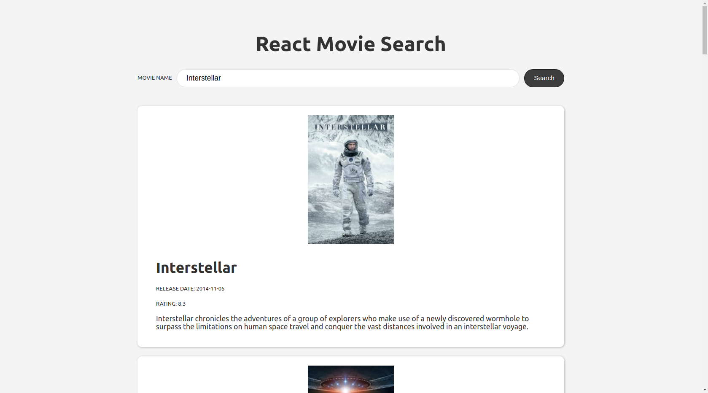

# React Movie Search

An app the consumes the [TMBD](https://www.themoviedb.org/)'s API to search and show information about movies.

Code from https://scrimba.com/course/greactmovie

## Installation

This project was bootstrapped with [Create React App](https://github.com/facebook/create-react-app).

In the project directory, you can run:

### `yarn start`

Runs the app in the development mode. 
Open [http://localhost:3000](http://localhost:3000) to view it in the browser.
